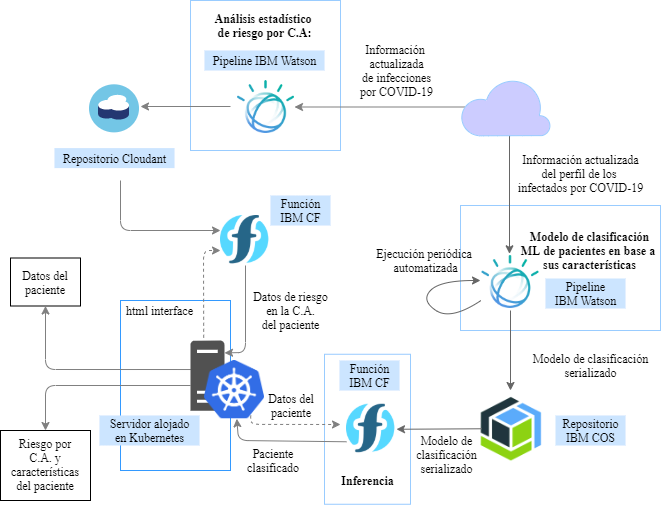

# Next Level Hackathon2020

Demo: [nlh2020covid.hopto.org/](http://nlh2020covid.hopto.org/)

## Descripción del proyecto: COVIDpred
COVIDpred es un predictor personalizado del impacto de la COVID-19 en la nube. A partir de
un simple formulario, el usuario puede conocer el impacto potencial de un contagio por
COVID-19 (en riesgo de ingreso a la Unidad de Cuidados Intensivos y probabilidad de
fallecimiento), así como una predicción de la tendencia de contagios de su comunidad
autónoma de origen.

## Arquitectura
Nuestro sistema está construido completamente sobre IBM Cloud, desacoplando los servicios 
de almacenamiento y procesamiento ML del servidor mediante funciones serverless. Sigue un
diseño modular, basado en una interfaz HTTP sobre un servidor alojado en Kubernetes, 
IBM Cloud Functions, IBM Cloud Object Storage, Cloudant e IBM Watson.

## Equipo
Somos Byzantine Generals, un equipo de la Universitat Rovira i Virgili (Tarragona), becarios
con contrato de investigación en el grupo CloudLab.
* Aitor Arjona aitor.arjona@urv.cat
* Pablo Gimeno pablo.gimeno@urv.cat
* German Eizaguirre germantelmo.eizaguirre@urv.cat

### Links
- [Datos casos nacional](https://datos.gob.es/es/catalogo/e05070101-evolucion-de-enfermedad-por-el-coronavirus-covid-19)
